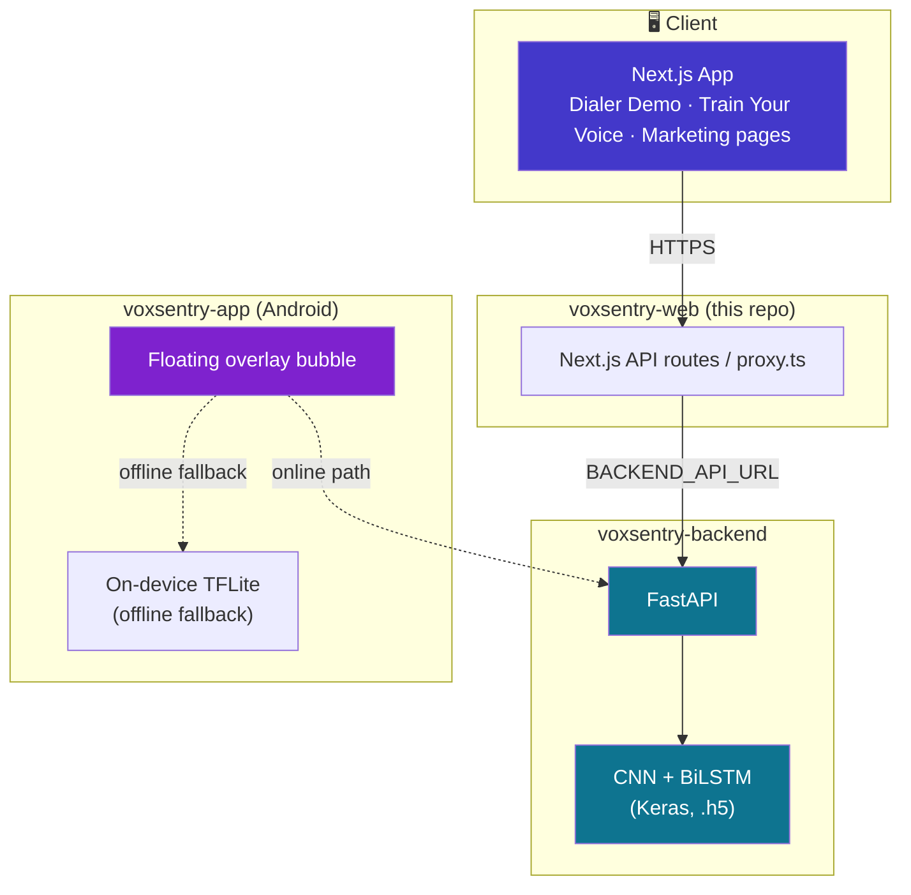

<div align="center">

# 🛡️ VoxSentry

### AI-Powered Real-Time Voice Clone Detection

**Detecting synthetic and cloned voices in live calls — before the scam happens.**

Built for **Smart India Hackathon 2026** · Problem Statement **SIH26104**
*"AI-Powered Real-Time Detection and Prevention of Voice Cloning Impersonation Attacks"*

[](https://voxsentry-web.vercel.app)
[](https://nextjs.org)
[](https://www.typescriptlang.org/)
[](https://fastapi.tiangolo.com/)
[](https://tailwindcss.com/)

[](https://github.com/vineetm1204-m/voxsentry-web/stargazers)
[](https://github.com/vineetm1204-m/voxsentry-web/network/members)
[](https://github.com/vineetm1204-m/voxsentry-web/commits/master)
[](#-roadmap)

<br/>

<a href="#-live-demo"><strong>Try the Live Demo »</strong></a>
·
<a href="#-getting-started">Getting Started</a>
·
<a href="#-architecture">Architecture</a>
·
<a href="#-roadmap">Roadmap</a>

</div>

<br/>

> [!TIP]
> **Judges / evaluators:** click **[Try Live Demo](https://voxsentry-web.vercel.app)** → **Guest / Judge Mode** to jump straight into the Dialer Demo with no signup. See [Success Criteria](#-what-a-judge-should-experience) for the intended 60-second flow.

---

## 📑 Table of Contents

<details open>
<summary>Click to expand</summary>

- [Overview](#-overview)
- [Live Demo](#-live-demo)
- [Feature Tour](#-feature-tour)
- [Architecture](#-architecture)
- [Tech Stack](#-tech-stack)
- [Getting Started](#-getting-started)
  - [Prerequisites](#prerequisites)
  - [Run the Backend](#1️⃣-start-the-fastapi-backend)
  - [Run the Frontend](#2️⃣-start-the-nextjs-frontend)
  - [Environment Variables](#environment-variables)
- [Project Structure](#-project-structure)
- [Target Users](#-target-users)
- [Roadmap](#-roadmap)
- [Related Repositories](#-related-repositories)
- [Team](#-team)
- [Documentation](#-documentation)
- [License](#-license)

</details>

---

## 🔍 Overview

Voice-cloning scams — a fake "relative in trouble" call, a spoofed CEO or bank voice — are getting harder to catch by ear alone. **VoxSentry** listens to a live call and tells you, in real time, whether the voice on the other end is **real or AI-generated**, with a confidence score and an explanation, before any harm is done.

This repository is the **web platform**: it showcases the product, hosts the Android APK download, and gives anyone — especially hackathon judges — a **live, in-browser demo** of the detection technology without installing anything.

The full VoxSentry system has three parts, working together:

| Component | Repo | Role |
|---|---|---|
| 🌐 **Web app** *(this repo)* | `voxsentry-web` | Marketing site + live in-browser Dialer Demo + APK download |
| ⚙️ **ML backend** | `voxsentry-backend` | FastAPI service serving the CNN+BiLSTM spoof-detection model |
| 📱 **Android app** | `voxsentry-app` | Real-time call protection via a floating overlay bubble |

---

## 🚀 Live Demo

<div align="center">

**[🔗 voxsentry-web.vercel.app](https://voxsentry-web.vercel.app)**

</div>

### What a judge should experience


> Landing → understanding → a tested, explained verdict — all in **under 60 seconds**, with zero account creation required.

---

## 🎛️ Feature Tour

<details>
<summary><strong>🏠 Homepage</strong> — convert visitors into downloaders or demo-testers in seconds</summary>
<br/>

- Hero section with headline, subheadline, and dual CTAs (**Download App** / **Try Live Demo**)
- Center-column looping demo video
- Feature grid (3–6 cards)
- Stats strip — accuracy & latency numbers
- Lazy-loaded 3D interactive background (Three.js) so it never blocks first paint
- Team section + footer

</details>

<details>
<summary><strong>📲 Download App</strong> — get a curious visitor to an installed, protected user</summary>
<br/>

- APK download CTA
- 4-step setup flow: download → install → grant overlay permission → protected
- Screenshots of the app in action
- An honest **"what this does NOT do"** section
- System requirements

</details>

<details>
<summary><strong>🔐 Login / Sign Up</strong> — gate before the live demo</summary>
<br/>

- Email + password form, Google login option
- **Guest / Judge Mode** — skips straight into the demo, no account needed

</details>

<details>
<summary><strong>☎️ Dialer Demo</strong> — the centerpiece: test the AI live, in-browser</summary>
<br/>

- Simulated phone call screen
- Dropdown / upload to pick an audio clip
- Live waveform visualization
- Verdict pill — **Cloned / Real** + confidence %
- Explainability panel with spectrogram
- Scenario presets: bank fraud, family emergency, CEO impersonation

</details>

<details>
<summary><strong>🎙️ Train Your Voice</strong> — personalized voice enrollment</summary>
<br/>

- Consent screen
- Guided multi-sample recording flow with live progress
- Audio quality validation
- Processing / embedding animation
- Voice library dashboard — one card per enrolled person
- "Test this voice" → feeds straight into the Dialer Demo

> **Note:** currently runs the generic spoof detector rather than personalized identity matching — full voice-enrollment embedding matching is a [roadmap item](#-roadmap).

</details>

---

## 🏗️ Architecture

VoxSentry's web platform runs a **two-server architecture**: a Next.js frontend and a FastAPI backend that serves the ML model.



**Locally, both servers must be running** — the Next.js dev server proxies ML inference requests to FastAPI via `BACKEND_API_URL`.

---

## 🧰 Tech Stack

<table>
<tr>
<td valign="top" width="33%">

**Frontend**
- Next.js (App Router)
- TypeScript
- Tailwind CSS
- Three.js *(lazy-loaded 3D)*

</td>
<td valign="top" width="33%">

**Backend / ML**
- FastAPI · Python
- TensorFlow / Keras
- CNN + BiLSTM model
- librosa · NumPy

</td>
<td valign="top" width="33%">

**Deployment**
- Vercel *(frontend)*
- Vultr VPS + Docker + Nginx *(backend)*
- Certbot SSL

</td>
</tr>
</table>

---

## ⚡ Getting Started

### Prerequisites

- Node.js (LTS) and npm
- Python 3.x + a virtual environment for the backend
- The [`voxsentry-backend`](#-related-repositories) repo cloned as a sibling directory

### 1️⃣ Start the FastAPI Backend

Open a terminal, move to the backend repo, and start the server:

```bash
cd ../voxsentry-backend
# activate your virtual environment if you have one
uvicorn app.main:app --reload --port 8000
```

Backend runs at `http://localhost:8000`.

### 2️⃣ Start the Next.js Frontend

Open a second terminal in this repo:

```bash
git clone https://github.com/vineetm1204-m/voxsentry-web.git
cd voxsentry-web
npm install
npm run dev
```

Frontend runs at `http://localhost:3000`.

### Environment Variables

Create `voxsentry-web/.env.local`:

```env
BACKEND_API_URL=http://localhost:8000
```

> [!IMPORTANT]
> Without `BACKEND_API_URL` set correctly, the frontend cannot proxy inference requests to the FastAPI backend and the Dialer Demo will not work locally.

---

## 📁 Project Structure

<details>
<summary>Click to expand folder layout</summary>

```
voxsentry-web/
├── app/            # Next.js App Router pages (homepage, dialer demo, train voice, auth)
├── components/     # Reusable UI components
├── hooks/          # Custom React hooks
├── lib/            # Utilities, API clients, helpers
├── providers/       # Context / app-wide providers
├── public/         # Static assets
├── services/       # API service layer (calls to FastAPI backend)
├── proxy.ts         # Backend proxy configuration
├── ARCHITECTURE.md  # Detailed architecture notes
├── PRD.md           # Product requirements document
├── DESIGN.md         # Design system reference
├── PHASES.md         # Build phases
└── RULES.md           # Project conventions
```

Deep-dive docs live right in the repo root — see [Documentation](#-documentation).

</details>

---

## 👥 Target Users

| Who | Need |
|---|---|
| 🙋 **End users** | Install the Android app for real-world call protection |
| 🧑‍⚖️ **Hackathon judges** | Understand and test the tech in under a minute — no install required |
| 👨‍👩‍👧 **Families** | Enroll trusted voices (Mom, Dad) so the system can flag a cloned impersonation |

---

## 🗺️ Roadmap

- [x] Homepage, feature grid, stats strip
- [x] Dialer Demo with live waveform + verdict pill
- [x] Guest / Judge Mode (no-signup demo access)
- [x] Android APK download flow
- [ ] Wire Dialer Demo to the live FastAPI backend (currently mockable/stubbed)
- [ ] Voice enrollment embedding model for **Train Your Voice** (personalized identity matching, beyond generic spoof detection)
- [ ] Production auth (email verification, password reset)
- [ ] iOS app *("Coming Soon")*

---

## 🔗 Related Repositories

- 🌐 **`voxsentry-web`** *(this repo)* — Next.js marketing site + live demo
- ⚙️ [`voxsentry-backend`](../../../voxsentry-backend) — FastAPI inference service (CNN+BiLSTM)
- 📱 `voxsentry-app` — React Native (Expo) Android app with real-time call overlay

---

## 🧑‍💻 Team

Built by a 6-person team for **Smart India Hackathon 2026**.

---

## 📚 Documentation

Deeper project docs live in the repo root:

| Doc | Contents |
|---|---|
| [`PRD.md`](./PRD.md) | Product requirements, target users, success criteria |
| [`ARCHITECTURE.md`](./ARCHITECTURE.md) | System architecture details |
| [`DESIGN.md`](./DESIGN.md) | Design system, tokens, UI conventions |
| [`PHASES.md`](./PHASES.md) | Build phases and sequencing |
| [`RULES.md`](./RULES.md) | Project conventions and constraints |

---

## 📄 License

*Add a license for this project (e.g. MIT) — see [choosealicense.com](https://choosealicense.com/) for guidance.*

<div align="center">

<br/>

**[⬆ back to top](#️-voxsentry)**

</div>
